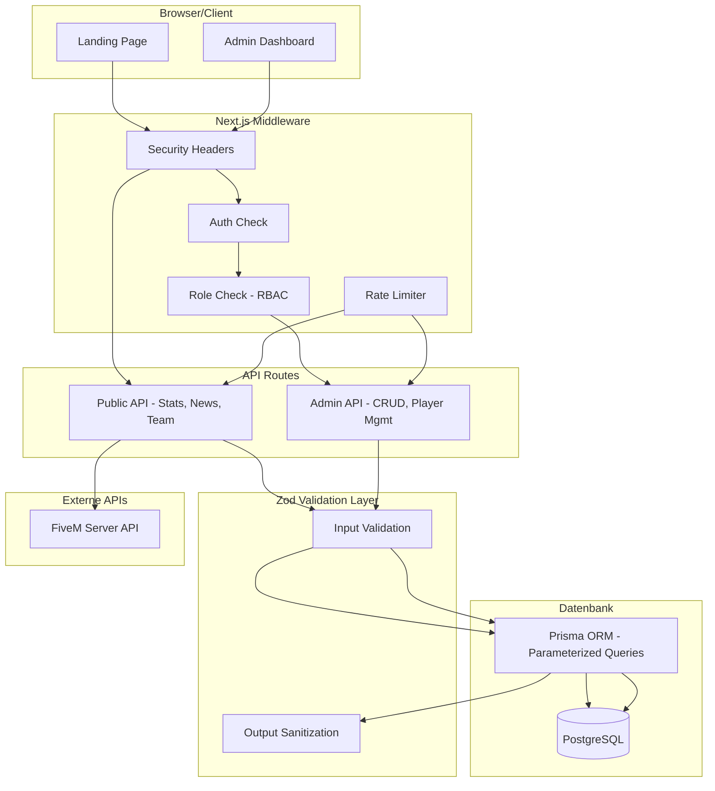
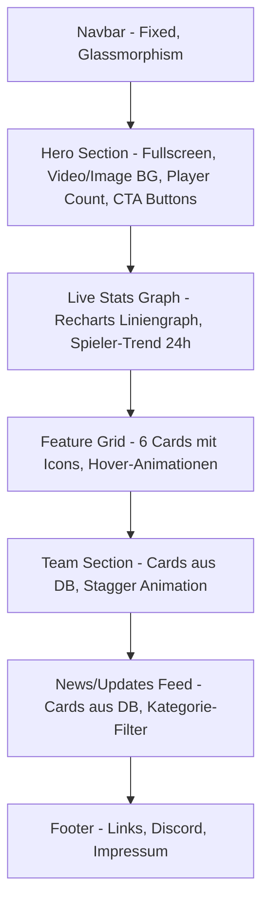
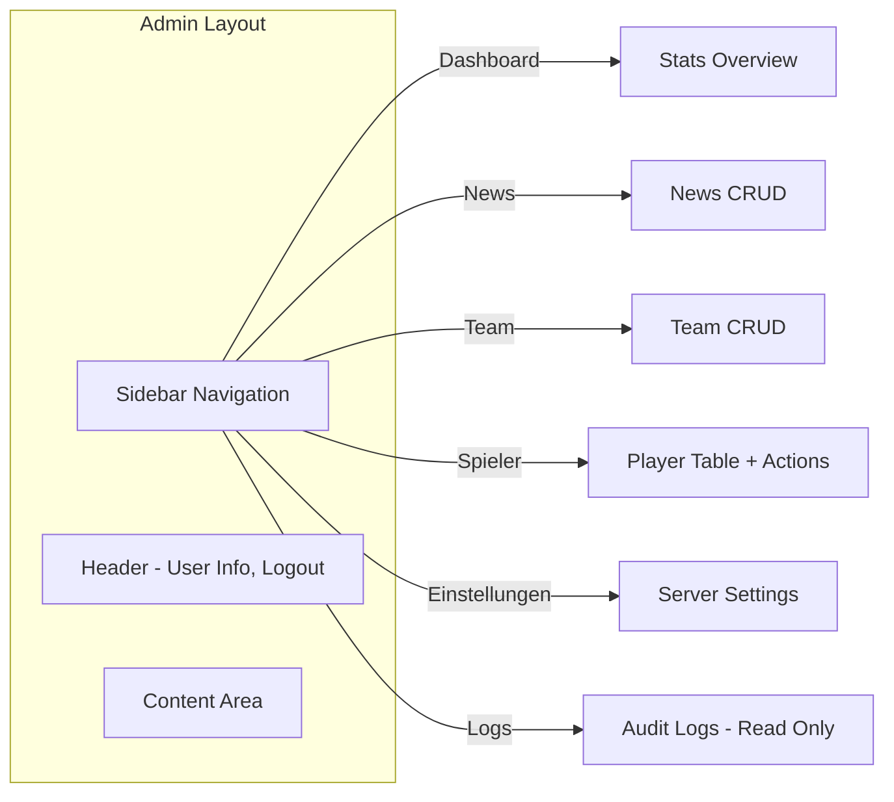
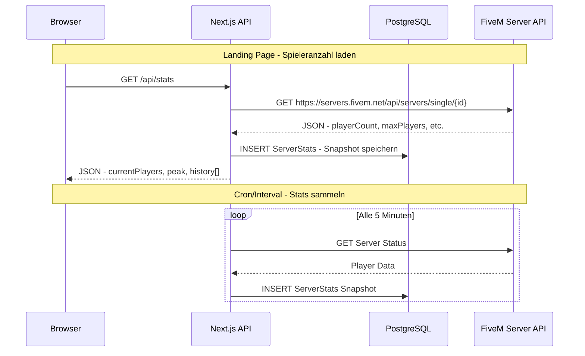

# 🏙️ Sona City – Web Application Architecture Plan

## 📋 Projektübersicht

**Projekt:** Sona City FiveM Roleplay Server – Landing Page + Admin Dashboard (CMS)
**Vibe:** Dark, Premium, High-End Gaming
**Primary Accent:** `#e2491c` (Vibrant Orange) | **Background:** `#0a0a0a` | **Surface:** Glassmorphism/Blur

---

## 🛠️ Tech Stack

| Kategorie | Technologie | Version |
|-----------|-------------|---------|
| Framework | Next.js (App Router) | 15+ |
| Sprache | TypeScript (Strict Mode) | 5.x |
| Styling | Tailwind CSS + Shadcn/UI | 4.x / latest |
| Datenbank | PostgreSQL (lokal für Dev) | 16+ |
| ORM | Prisma | 6.x |
| Auth | NextAuth.js | v5 (beta) |
| 2FA | otplib (TOTP) + qrcode | latest |
| Bild-Upload | Uploadthing (Cloud) | latest |
| Validation | Zod | 3.x |
| Animation | Framer Motion | 11.x |
| Charts | Recharts | 2.x |
| Rate Limiting | Custom In-Memory + optional Upstash | - |
| Icons | Lucide React | latest |

---

## 📁 Ordnerstruktur

```
sona-city-web/
├── .env.local                    # Umgebungsvariablen (NICHT committen)
├── .env.example                  # Template für Umgebungsvariablen
├── next.config.ts                # Next.js Config + Security Headers
├── tailwind.config.ts            # Tailwind Konfiguration
├── tsconfig.json                 # TypeScript Strict Mode
├── prisma/
│   ├── schema.prisma             # Datenbank-Schema
│   ├── seed.ts                   # Seed-Daten für Entwicklung
│   └── migrations/               # Auto-generierte Migrationen
├── public/
│   ├── fonts/                    # Custom Fonts
│   ├── images/                   # Statische Bilder
│   │   ├── hero-bg.webp
│   │   ├── logo.svg
│   │   └── team/                 # Team-Member Avatare (Fallback)
│   └── favicon.ico
├── src/
│   ├── app/
│   │   ├── layout.tsx            # Root Layout (Fonts, Metadata, Providers)
│   │   ├── page.tsx              # Landing Page (Public)
│   │   ├── globals.css           # Globale Styles + Tailwind Directives
│   │   ├── not-found.tsx         # Custom 404
│   │   ├── error.tsx             # Global Error Boundary
│   │   │
│   │   ├── (public)/             # Route Group: Public Pages
│   │   │   ├── page.tsx          # Landing Page (Re-export oder Redirect)
│   │   │   └── impressum/
│   │   │       └── page.tsx      # Impressum/Legal
│   │   │
│   │   ├── admin/                # Admin Dashboard (geschützt via Middleware)
│   │   │   ├── layout.tsx        # Admin Layout (Sidebar, Auth-Check)
│   │   │   ├── page.tsx          # Dashboard Home (Stats Overview)
│   │   │   ├── news/
│   │   │   │   ├── page.tsx      # News-Liste (CRUD)
│   │   │   │   ├── new/
│   │   │   │   │   └── page.tsx  # Neuen Post erstellen
│   │   │   │   └── [id]/
│   │   │   │       └── edit/
│   │   │   │           └── page.tsx # Post bearbeiten
│   │   │   ├── team/
│   │   │   │   ├── page.tsx      # Team verwalten
│   │   │   │   └── new/
│   │   │   │       └── page.tsx  # Neues Teammitglied
│   │   │   ├── players/
│   │   │   │   └── page.tsx      # Spieler-Management (Tabelle)
│   │   │   ├── settings/
│   │   │   │   └── page.tsx      # Server-Einstellungen
│   │   │   └── logs/
│   │   │       └── page.tsx      # Audit Logs (immutable)
│   │   │
│   │   ├── api/
│   │   │   ├── auth/
│   │   │   │   └── [...nextauth]/
│   │   │   │       └── route.ts  # NextAuth.js v5 Route Handler
│   │   │   ├── auth/2fa/
│   │   │   │   ├── setup/
│   │   │   │   │   └── route.ts  # POST: 2FA einrichten (QR-Code)
│   │   │   │   ├── verify/
│   │   │   │   │   └── route.ts  # POST: 2FA Code verifizieren
│   │   │   │   └── disable/
│   │   │   │       └── route.ts  # POST: 2FA deaktivieren
│   │   │   ├── uploadthing/
│   │   │   │   └── route.ts      # Uploadthing File Upload Handler
│   │   │   ├── stats/
│   │   │   │   └── route.ts      # GET: Server-Stats + Player Count
│   │   │   ├── news/
│   │   │   │   ├── route.ts      # GET (public), POST (admin)
│   │   │   │   └── [id]/
│   │   │   │       └── route.ts  # GET, PUT, DELETE (admin)
│   │   │   ├── team/
│   │   │   │   ├── route.ts      # GET (public), POST (admin)
│   │   │   │   └── [id]/
│   │   │   │       └── route.ts  # PUT, DELETE (admin)
│   │   │   ├── players/
│   │   │   │   ├── route.ts      # GET, POST actions (admin only, DB-only)
│   │   │   │   └── [id]/
│   │   │   │       └── route.ts  # Player actions (ban/whitelist - DB only)
│   │   │   └── settings/
│   │   │       └── route.ts      # GET, PUT (admin only)
│   │   │
│   │   └── login/
│   │       └── page.tsx          # Admin Login Page
│   │
│   ├── components/
│   │   ├── ui/                   # Shadcn/UI Komponenten (auto-generiert)
│   │   │   ├── button.tsx
│   │   │   ├── card.tsx
│   │   │   ├── input.tsx
│   │   │   ├── dialog.tsx
│   │   │   ├── table.tsx
│   │   │   ├── badge.tsx
│   │   │   ├── toast.tsx
│   │   │   ├── dropdown-menu.tsx
│   │   │   └── ...
│   │   ├── landing/              # Landing Page Komponenten
│   │   │   ├── hero-section.tsx
│   │   │   ├── stats-graph.tsx
│   │   │   ├── feature-grid.tsx
│   │   │   ├── team-section.tsx
│   │   │   ├── news-feed.tsx
│   │   │   ├── footer.tsx
│   │   │   └── navbar.tsx
│   │   ├── admin/                # Admin Dashboard Komponenten
│   │   │   ├── sidebar.tsx
│   │   │   ├── admin-header.tsx
│   │   │   ├── stats-cards.tsx
│   │   │   ├── news-form.tsx
│   │   │   ├── team-form.tsx
│   │   │   ├── player-table.tsx
│   │   │   ├── audit-log-table.tsx
│   │   │   └── settings-form.tsx
│   │   └── shared/               # Geteilte Komponenten
│   │       ├── motion-wrapper.tsx
│   │       ├── loading-spinner.tsx
│   │       ├── error-display.tsx
│   │       └── page-transition.tsx
│   │
│   ├── lib/
│   │   ├── prisma.ts             # Prisma Client Singleton
│   │   ├── auth.ts               # NextAuth.js v5 Konfiguration
│   │   ├── auth-options.ts       # Auth Provider + Callbacks
│   │   ├── two-factor.ts         # 2FA Setup, Verify, Disable (otplib/qrcode)
│   │   ├── rate-limit.ts         # Rate Limiter Implementierung
│   │   ├── uploadthing.ts        # Uploadthing Client + File Router
│   │   ├── fivem-api.ts          # FiveM Server API Client
│   │   ├── utils.ts              # Utility-Funktionen (cn, formatDate, etc.)
│   │   └── constants.ts          # App-weite Konstanten
│   │
│   ├── schemas/                  # Zod Validation Schemas
│   │   ├── auth.schema.ts        # Login/Register Validation
│   │   ├── news.schema.ts        # News CRUD Validation
│   │   ├── team.schema.ts        # Team CRUD Validation
│   │   ├── player.schema.ts      # Player Action Validation
│   │   └── settings.schema.ts    # Settings Validation
│   │
│   ├── hooks/                    # Custom React Hooks
│   │   ├── use-server-stats.ts   # SWR/React Query für Live-Stats
│   │   ├── use-scroll-animation.ts
│   │   └── use-media-query.ts
│   │
│   ├── types/                    # TypeScript Type Definitions
│   │   ├── index.ts              # Zentrale Type Exports
│   │   ├── api.ts                # API Response Types
│   │   └── fivem.ts              # FiveM API Types
│   │
│   └── middleware.ts             # Next.js Middleware (Auth + RBAC + Rate Limit)
│
├── package.json
└── README.md
```

---

## 🗄️ Prisma Schema

```prisma
// prisma/schema.prisma

generator client {
  provider = "prisma-client-js"
}

datasource db {
  provider = "postgresql"
  url      = env("DATABASE_URL")
}

// ==========================================
// AUTH & USER MANAGEMENT
// ==========================================

enum Role {
  ADMIN
  MODERATOR
  VIEWER
}

model User {
  id              String    @id @default(cuid())
  email           String    @unique
  name            String?
  passwordHash    String    // bcrypt hashed
  role            Role      @default(VIEWER)
  image           String?
  twoFactorEnabled Boolean  @default(false)
  twoFactorSecret  String?  // TOTP Secret (encrypted)
  createdAt       DateTime  @default(now())
  updatedAt       DateTime  @updatedAt
  lastLoginAt     DateTime?

  // Relations
  auditLogs     AuditLog[]
  posts         Post[]      @relation("PostAuthor")

  @@map("users")
}

// ==========================================
// CONTENT MANAGEMENT
// ==========================================

model Post {
  id          String   @id @default(cuid())
  title       String
  slug        String   @unique
  content     String   // Markdown oder HTML
  excerpt     String?  // Kurzbeschreibung
  imageUrl    String?
  category    String   @default("update") // update, patch, event, announcement
  published   Boolean  @default(false)
  publishedAt DateTime?
  createdAt   DateTime @default(now())
  updatedAt   DateTime @updatedAt

  // Relations
  authorId    String
  author      User     @relation("PostAuthor", fields: [authorId], references: [id])

  @@index([published, publishedAt])
  @@index([slug])
  @@map("posts")
}

model TeamMember {
  id          String   @id @default(cuid())
  name        String
  role        String   // z.B. "Inhaber", "Developer", "Moderator"
  description String?
  imageUrl    String?
  discordId   String?
  sortOrder   Int      @default(0) // Für manuelle Sortierung
  visible     Boolean  @default(true)
  createdAt   DateTime @default(now())
  updatedAt   DateTime @updatedAt

  @@map("team_members")
}

// ==========================================
// SERVER & PLAYER MANAGEMENT
// ==========================================

model ServerStats {
  id            String   @id @default(cuid())
  playerCount   Int      @default(0)
  maxPlayers    Int      @default(128)
  peakPlayers   Int      @default(0)
  isOnline      Boolean  @default(true)
  recordedAt    DateTime @default(now())

  @@index([recordedAt])
  @@map("server_stats")
}

model ServerSettings {
  id                String   @id @default("default")
  serverName        String   @default("Sona City")
  serverIp          String   @default("")
  fivemServerId     String   @default("") // cfx.re Server-ID
  discordInvite     String   @default("")
  fivemConnectUrl   String   @default("") // fivem://connect/...
  maintenanceMode   Boolean  @default(false)
  maintenanceMsg    String   @default("Server ist im Wartungsmodus")
  manualPlayerPeak  Int?     // Falls API ausfällt
  heroTitle         String   @default("Willkommen in Sona City")
  heroSubtitle      String   @default("Dein neues Zuhause im Roleplay")
  updatedAt         DateTime @updatedAt

  @@map("server_settings")
}

model Player {
  id              String    @id @default(cuid())
  fivemId         String    @unique // Citizen/License ID
  name            String
  discordId       String?
  steamId         String?
  isWhitelisted   Boolean   @default(false)
  isBanned        Boolean   @default(false)
  banReason       String?
  bannedAt        DateTime?
  bannedUntil     DateTime? // null = permanent
  firstJoinedAt   DateTime  @default(now())
  lastSeenAt      DateTime  @default(now())
  totalPlaytime   Int       @default(0) // Minuten

  @@index([name])
  @@index([fivemId])
  @@index([isBanned])
  @@map("players")
}

// ==========================================
// AUDIT & SECURITY
// ==========================================

model AuditLog {
  id          String   @id @default(cuid())
  action      String   // z.B. "PLAYER_BAN", "POST_CREATE", "SETTINGS_UPDATE"
  targetType  String?  // z.B. "Player", "Post", "TeamMember"
  targetId    String?
  details     String?  // JSON String mit Details
  ipAddress   String?
  userAgent   String?
  createdAt   DateTime @default(now())

  // Relations
  userId      String
  user        User     @relation(fields: [userId], references: [id])

  @@index([action])
  @@index([createdAt])
  @@index([userId])
  @@map("audit_logs")
}

model PageView {
  id        String   @id @default(cuid())
  path      String
  userAgent String?
  referer   String?
  createdAt DateTime @default(now())

  @@index([path])
  @@index([createdAt])
  @@map("page_views")
}
```

---

## 🔒 Security-Architektur

### Systemübersicht



### 1. Middleware – Auth + RBAC

```typescript
// src/middleware.ts - Konzept

import { NextResponse } from "next/server";
import type { NextRequest } from "next/server";
import { getToken } from "next-auth/jwt";

// Geschützte Routen-Patterns
const ADMIN_ROUTES = ["/admin"];
const API_ADMIN_ROUTES = ["/api/players", "/api/settings", "/api/news", "/api/team"];
const PUBLIC_API_ROUTES = ["/api/stats", "/api/auth"];

export async function middleware(request: NextRequest) {
  const { pathname } = request.nextUrl;

  // 1. Security Headers für ALLE Requests
  const response = NextResponse.next();
  response.headers.set("X-Frame-Options", "DENY");
  response.headers.set("X-Content-Type-Options", "nosniff");
  response.headers.set("Referrer-Policy", "strict-origin-when-cross-origin");
  response.headers.set("X-XSS-Protection", "1; mode=block");
  response.headers.set(
    "Permissions-Policy",
    "camera=(), microphone=(), geolocation=()"
  );

  // 2. Admin-Routen schützen
  const isAdminRoute = ADMIN_ROUTES.some((r) => pathname.startsWith(r));
  const isAdminApi = API_ADMIN_ROUTES.some((r) => pathname.startsWith(r));

  if (isAdminRoute || isAdminApi) {
    const token = await getToken({
      req: request,
      secret: process.env.NEXTAUTH_SECRET,
    });

    // Nicht eingeloggt -> Login-Redirect
    if (!token) {
      if (isAdminApi) {
        return NextResponse.json({ error: "Unauthorized" }, { status: 401 });
      }
      return NextResponse.redirect(new URL("/login", request.url));
    }

    // Rolle prüfen (RBAC)
    if (token.role !== "ADMIN" && token.role !== "MODERATOR") {
      if (isAdminApi) {
        return NextResponse.json({ error: "Forbidden" }, { status: 403 });
      }
      return NextResponse.redirect(new URL("/", request.url));
    }
  }

  return response;
}

export const config = {
  matcher: ["/admin/:path*", "/api/:path*"],
};
```

### 2. Rate Limiting

```typescript
// src/lib/rate-limit.ts - Konzept

const rateLimitMap = new Map<string, { count: number; lastReset: number }>();

export function rateLimit(options: {
  windowMs: number;
  maxRequests: number;
}) {
  return {
    check: (identifier: string): { success: boolean; remaining: number } => {
      const now = Date.now();
      const record = rateLimitMap.get(identifier);

      if (!record || now - record.lastReset > options.windowMs) {
        rateLimitMap.set(identifier, { count: 1, lastReset: now });
        return { success: true, remaining: options.maxRequests - 1 };
      }

      if (record.count >= options.maxRequests) {
        return { success: false, remaining: 0 };
      }

      record.count++;
      return { success: true, remaining: options.maxRequests - record.count };
    },
  };
}

// Verwendung in API Routes:
// const limiter = rateLimit({ windowMs: 60_000, maxRequests: 30 });
// const { success } = limiter.check(ip);
// if (!success) return NextResponse.json({ error: "Too Many Requests" }, { status: 429 });
```

### 3. Zod Validation Schemas

```typescript
// src/schemas/news.schema.ts - Beispiel

import { z } from "zod";

export const createPostSchema = z.object({
  title: z
    .string()
    .min(3, "Titel muss mindestens 3 Zeichen lang sein")
    .max(200, "Titel darf maximal 200 Zeichen lang sein")
    .trim(),
  content: z
    .string()
    .min(10, "Inhalt muss mindestens 10 Zeichen lang sein")
    .max(50000),
  excerpt: z.string().max(500).optional(),
  category: z.enum(["update", "patch", "event", "announcement"]),
  published: z.boolean().default(false),
  imageUrl: z.string().url().optional().or(z.literal("")),
});

export const updatePostSchema = createPostSchema.partial();

export type CreatePostInput = z.infer<typeof createPostSchema>;
export type UpdatePostInput = z.infer<typeof updatePostSchema>;
```

### 4. Security Headers in `next.config.ts`

```typescript
// next.config.ts - Security Headers

const securityHeaders = [
  { key: "X-DNS-Prefetch-Control", value: "on" },
  { key: "Strict-Transport-Security", value: "max-age=63072000; includeSubDomains; preload" },
  { key: "X-Frame-Options", value: "SAMEORIGIN" },
  { key: "X-Content-Type-Options", value: "nosniff" },
  { key: "Referrer-Policy", value: "strict-origin-when-cross-origin" },
  { key: "Permissions-Policy", value: "camera=(), microphone=(), geolocation=(), browsing-topics=()" },
  {
    key: "Content-Security-Policy",
    value: [
      "default-src 'self'",
      "script-src 'self' 'unsafe-eval' 'unsafe-inline'", // Next.js benötigt unsafe-eval in Dev
      "style-src 'self' 'unsafe-inline'",
      "img-src 'self' data: blob: https:",
      "font-src 'self'",
      "connect-src 'self' https://servers.fivem.net",
      "frame-ancestors 'none'",
    ].join("; "),
  },
];
```

---

## 🎨 Frontend-Architektur (Landing Page)

### Sektionen-Flow



### Komponentenarchitektur

| Komponente | Datenquelle | Animation |
|-----------|-------------|-----------|
| [`hero-section.tsx`](src/components/landing/hero-section.tsx) | `GET /api/stats` (Player Count) + `ServerSettings` | Fade-in, Floating Particles |
| [`stats-graph.tsx`](src/components/landing/stats-graph.tsx) | `GET /api/stats?range=24h` (ServerStats[]) | Slide-up on scroll |
| [`feature-grid.tsx`](src/components/landing/feature-grid.tsx) | Statische Daten (konstant) | Stagger fade-in |
| [`team-section.tsx`](src/components/landing/team-section.tsx) | `GET /api/team` (TeamMember[]) | Stagger slide-up |
| [`news-feed.tsx`](src/components/landing/news-feed.tsx) | `GET /api/news?limit=6` (Post[]) | Stagger fade-in |

### Design Tokens

```css
/* globals.css */
:root {
  --color-accent: #e2491c;
  --color-accent-hover: #ff5a2e;
  --color-bg-primary: #0a0a0a;
  --color-bg-surface: rgba(255, 255, 255, 0.05);
  --color-bg-glass: rgba(255, 255, 255, 0.08);
  --color-text-primary: #ffffff;
  --color-text-secondary: #a0a0a0;
  --color-border: rgba(255, 255, 255, 0.1);
  --glass-blur: 12px;
}
```

---

## 🖥️ Admin Dashboard-Architektur

### Dashboard-Layout



### Admin-Seiten Detail

| Seite | Features | API Routes |
|-------|----------|------------|
| Dashboard | Stats-Karten: Views, Players online, Whitelist-Anträge, Server-Status | `GET /api/stats` |
| News | Tabelle aller Posts, Create/Edit/Delete, Markdown-Editor, Publish Toggle | `CRUD /api/news` |
| Team | Sortierbare Liste, Drag-and-Drop Reihenfolge, Bild-Upload | `CRUD /api/team` |
| Spieler | Suchbare Tabelle, Ban/Kick/Whitelist Actions, Filter nach Status | `GET/POST /api/players` |
| Einstellungen | Maintenance Toggle, Server-IP, Discord Link, Hero-Text, Manual Peak | `GET/PUT /api/settings` |
| Logs | Unveränderliche Tabelle, Filter nach Action/User/Datum, Pagination | `GET /api/logs` |

### RBAC-Matrix

| Aktion | ADMIN | MODERATOR | VIEWER |
|--------|-------|-----------|--------|
| Dashboard ansehen | ✅ | ✅ | ✅ |
| News erstellen/bearbeiten | ✅ | ✅ | ❌ |
| News löschen | ✅ | ❌ | ❌ |
| Team verwalten | ✅ | ❌ | ❌ |
| Spieler bannen/kicken | ✅ | ✅ | ❌ |
| Einstellungen ändern | ✅ | ❌ | ❌ |
| Audit Logs ansehen | ✅ | ✅ | ❌ |
| Benutzer verwalten | ✅ | ❌ | ❌ |

---

## 🔄 Datenfluss: FiveM API Integration



---

## 📦 Dependencies

```json
{
  "dependencies": {
    "next": "^15.0.0",
    "react": "^19.0.0",
    "react-dom": "^19.0.0",
    "typescript": "^5.7.0",
    "@prisma/client": "^6.0.0",
    "next-auth": "^5.0.0-beta",
    "@auth/prisma-adapter": "latest",
    "zod": "^3.23.0",
    "bcryptjs": "^2.4.3",
    "framer-motion": "^11.0.0",
    "recharts": "^2.12.0",
    "lucide-react": "latest",
    "class-variance-authority": "latest",
    "clsx": "latest",
    "tailwind-merge": "latest",
    "@radix-ui/react-slot": "latest",
    "@radix-ui/react-dialog": "latest",
    "@radix-ui/react-dropdown-menu": "latest"
  },
  "devDependencies": {
    "prisma": "^6.0.0",
    "tailwindcss": "^4.0.0",
    "@types/node": "latest",
    "@types/react": "latest",
    "@types/bcryptjs": "latest",
    "eslint": "latest",
    "eslint-config-next": "latest"
  }
}
```

---

## 🚀 Implementierungsreihenfolge

### Phase 1: Foundation
1. Next.js Projekt initialisieren mit TypeScript Strict Mode
2. Tailwind CSS + Shadcn/UI einrichten
3. Prisma Schema erstellen und Datenbank migrieren
4. NextAuth.js v5 mit Credentials Provider konfigurieren
5. Middleware für Auth + RBAC implementieren
6. Security Headers in next.config.ts
7. Zod Schemas für alle Entities
8. Rate Limiting Utility
9. Prisma Client Singleton + Seed Script

### Phase 2: Public Frontend
10. Root Layout mit Fonts, Metadata, Providers
11. Navbar Komponente (fixed, glassmorphism)
12. Hero Section mit Player Count
13. FiveM API Integration (Live Stats)
14. Stats Graph mit Recharts
15. Feature Grid
16. Team Section (Daten aus DB)
17. News/Updates Feed (Daten aus DB)
18. Footer
19. Framer Motion Scroll-Animationen
20. Responsive Design + Mobile Optimierung

### Phase 3: Admin Dashboard
21. Admin Layout (Sidebar + Header)
22. Dashboard Home mit Stats-Karten
23. News CRUD (Liste, Erstellen, Bearbeiten, Löschen)
24. Team Management (CRUD + Sortierung)
25. Player Management Tabelle (Such, Filter, Actions)
26. Server Settings Seite
27. Audit Log Viewer
28. Login Page mit sicherem Formular

### Phase 4: Polish & Security Hardening
29. Error Boundaries + Loading States
30. 404 Page
31. Accessibility Audit
32. Performance Optimierung (Image Optimization, Lazy Loading)
33. Finale Security Review (OWASP Checklist)
34. README + Dokumentation
35. Seed-Daten für Demo/Entwicklung

---

## ⚠️ Sicherheits-Checkliste (OWASP Top 10)

| # | Risiko | Maßnahme | Status |
|---|--------|----------|--------|
| A01 | Broken Access Control | Middleware RBAC, Server-side Auth Checks | Geplant |
| A02 | Cryptographic Failures | bcrypt für Passwörter, HTTPS erzwungen, Secrets in .env | Geplant |
| A03 | Injection | Prisma ORM (parameterized), Zod Input Validation | Geplant |
| A04 | Insecure Design | RBAC Matrix, Audit Logs, Principle of Least Privilege | Geplant |
| A05 | Security Misconfiguration | Security Headers, CSP, kein Debug in Production | Geplant |
| A06 | Vulnerable Components | npm audit, regelmäßige Updates | Geplant |
| A07 | Auth Failures | NextAuth.js, Session Management, Rate Limiting on Login | Geplant |
| A08 | Data Integrity | Immutable Audit Logs, Zod Validation | Geplant |
| A09 | Logging & Monitoring | AuditLog Model, Structured Logging | Geplant |
| A10 | SSRF | Whitelist für externe API Calls (nur FiveM API) | Geplant |
