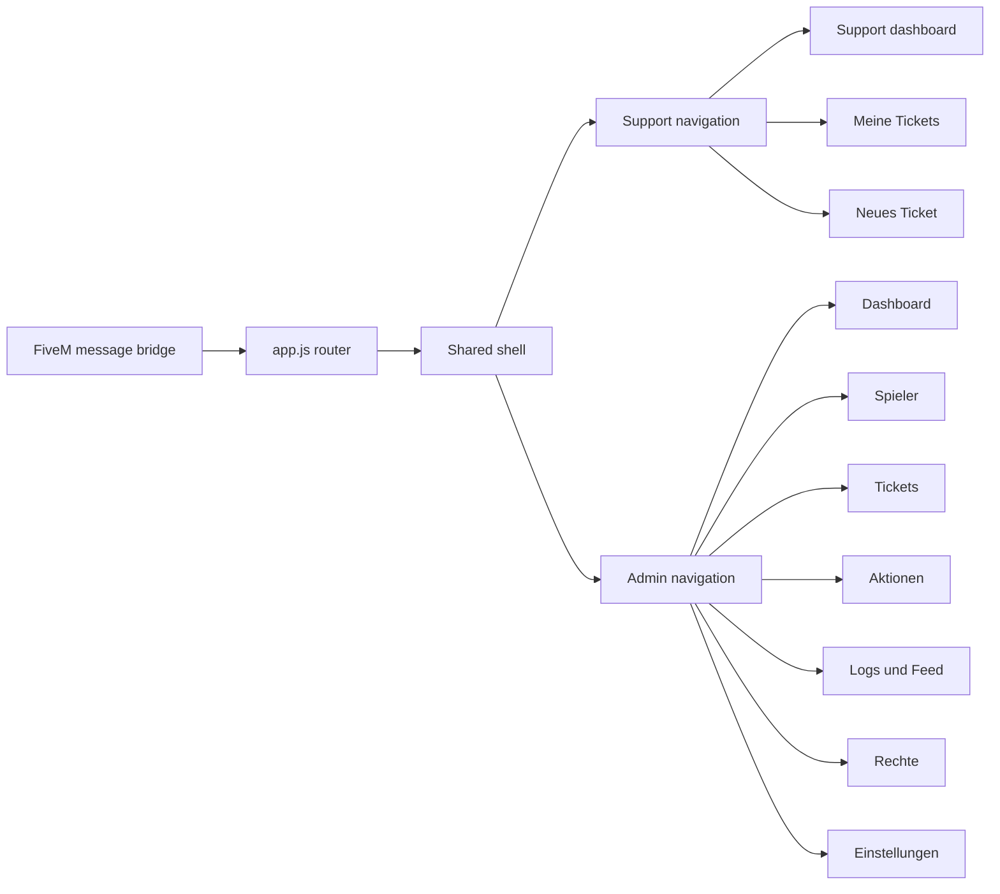

# Plan für den kompletten NUI-Neuaufbau von sc_grpadmin

## Zielbild

Das bisherige NUI in [`in_arbeit/sc_grpadmin/web/index.html`](../in_arbeit/sc_grpadmin/web/index.html), [`in_arbeit/sc_grpadmin/web/style.css`](../in_arbeit/sc_grpadmin/web/style.css) und [`in_arbeit/sc_grpadmin/web/app.js`](../in_arbeit/sc_grpadmin/web/app.js) wird nicht nur optisch angepasst, sondern strukturell neu aufgebaut.

Der Neuaufbau soll:

- die aktuelle Mischstruktur aus Support- und Admin-Ansicht vereinheitlichen
- eine klare Header-Sidebar-Content-Architektur liefern
- den schwarzen Hintergrund-Bug aktiv vermeiden
- auf älterem FiveM-Chromium stabil bleiben
- oben rechts nur einen klaren ESC-Schließen-Button zeigen
- den Ordner [`BACKUPS/`](../BACKUPS) unangetastet lassen

## Bisherige Erkenntnisse

### Bestehende technische Anbindung, die erhalten bleiben sollte

- FiveM lädt weiter über [`ui_page 'web/index.html'`](../in_arbeit/sc_grpadmin/fxmanifest.lua)
- Die Message-Bridge über [`window.addEventListener('message')`](../in_arbeit/sc_grpadmin/web/app.js) bleibt als Kernintegration erhalten
- Der POST-Helfer aus [`post()`](../in_arbeit/sc_grpadmin/web/app.js) ist brauchbar und sollte in bereinigter Form bestehen bleiben
- Die UI-State-Rückmeldung aus [`postUiState()`](../in_arbeit/sc_grpadmin/web/app.js) ist für Fokus und Open-Close-Synchronisierung sinnvoll
- Das Copy-Pattern in [`copyText()`](../in_arbeit/sc_grpadmin/web/app.js) mit [`document.execCommand('copy')`](../in_arbeit/sc_grpadmin/web/app.js) ist FiveM-kompatibel und sollte weiterverwendet werden

### Hauptprobleme im aktuellen NUI

- Die Struktur in [`web/index.html`](../in_arbeit/sc_grpadmin/web/index.html) ist sehr groß, gemischt und schwer pflegbar
- Es gibt zu viele separate Bereiche und Spezialpanels mit uneinheitlicher Logik
- Die aktuelle Shell verwendet fast deckende Flächen wie [`background: rgba(11, 15, 22, 0.98)`](../in_arbeit/sc_grpadmin/web/style.css) und [`background: rgba(19, 24, 35, 0.96)`](../in_arbeit/sc_grpadmin/web/style.css), was den transparenten Eindruck verhindert und FiveM-Fehlerbilder begünstigt
- Es existieren viele verstreute DOM-Referenzen in [`web/app.js`](../in_arbeit/sc_grpadmin/web/app.js), wodurch ein echter Neuaufbau sinnvoller ist als weiteres Flicken
- Die aktuelle Admin-Navigation ist funktional, aber inhaltlich zu breit und visuell zu unruhig
- Quick-Actions und Detailbereiche sind zu stark verteilt und wirken teilweise wie eine Button-Wand

### Sinnvolle Referenzen

- Der einfache ESC-Button-Aufbau in [`nui-reference/index.html`](../in_arbeit/sc_grpadmin/nui-reference/index.html) ist als Ausgangsmuster geeignet
- Die lokale Settings-Persistenz in [`loadUiSettings()`](../in_arbeit/sc_grpadmin/web/app.js) kann reduziert weitergenutzt werden
- Der Screenshot-Flow und die Capture-Dateien in [`web/capture_assets`](../in_arbeit/sc_grpadmin/web/capture_assets) werden nur behalten, wenn der bestehende Screenshot-Use-Case aktiv benötigt wird

## Neue Gesamtarchitektur

Es wird eine gemeinsame UI-Shell geben, die sowohl für Support als auch Admin verwendet wird.

### Shell-Aufbau

1. Globaler Root mit transparentem Seitenhintergrund
2. Zentrale Panel-Shell mit halbtransparenter Oberfläche
3. Fester Header
4. Linke Sidebar mit Modus-spezifischer Navigation
5. Rechter Content-Bereich mit klaren Seitenzuständen
6. Separate Overlays für Toast, Modals, Screenshot und optionale Quick-Action-Palette

### Modus-Logik

- `support` und `apanel` bleiben als Backend-Modi erhalten
- Beide Modi teilen sich dieselbe Shell
- Nur Navigation, Titel und Seiteninhalte wechseln
- Dadurch bleiben Öffnen, Schließen und Fokus deutlich einfacher

```mermaid
flowchart LR
    A[FiveM message bridge] --> B[app.js router]
    B --> C[Shared shell]
    C --> D[Support navigation]
    C --> E[Admin navigation]
    D --> F[Support dashboard]
    D --> G[Meine Tickets]
    D --> H[Neues Ticket]
    E --> I[Dashboard]
    E --> J[Spieler]
    E --> K[Tickets]
    E --> L[Aktionen]
    E --> M[Logs und Feed]
    E --> N[Rechte]
    E --> O[Einstellungen]
```

## Geplanter Neuaufbau von HTML

[`in_arbeit/sc_grpadmin/web/index.html`](../in_arbeit/sc_grpadmin/web/index.html) wird komplett neu strukturiert.

### Beibehaltene Root-Container

Diese äußeren Einstiegspunkte bleiben aus Integrationsgründen bestehen oder werden in gleichwertiger Form neu angelegt:

- `#app`
- `#overlay`
- `#feed`
- `#toast`
- Screenshot-Modal
- Action-Modal
- optionale Quick-Action-Palette nur wenn der Serverfluss sie weiter nutzt

### Neue innere Struktur

- Header mit Branding links
- Oberer rechter Bereich nur mit ESC-Schließen-Button
- Sidebar links mit Icons plus Labels
- Hauptbereich rechts mit Page-Switching über saubere Sections
- Einheitliche Card-Struktur für KPIs, Listen, Detailpanels und Settings-Blöcke

### Seitenstruktur Support

- Übersicht
  - offene eigene Tickets
  - letzter Ticketstatus
  - klare Schnellhinweise
- Meine Tickets
  - Suche
  - Ticketliste
  - Thread rechts oder untergeordnet im Detailbereich
- Neues Ticket
  - Betreff
  - Priorität
  - Labels optional
  - Nachricht

### Seitenstruktur Admin

- Dashboard
  - wichtige Kennzahlen
  - offene Tickets hervorgehoben
  - aktive Admin-Infos kompakt
  - kurze Feed-Vorschau
- Spieler
  - Suche links oben
  - kompakte Liste
  - rechter Detailbereich mit kopierbaren IDs, Lizenzen, HWIDs und logisch gruppierten Aktionen
- Tickets
  - Filterleiste
  - Ticketliste
  - Thread und interne Notizen im Detailbereich
- Aktionen
  - gruppierte Schnellaktionen
  - Teleport und Utility getrennt von Moderationsaktionen
  - gefährliche Aktionen visuell klar, aber nicht dramatisch
- Logs und Feed
  - Timeline oder Listenansicht
  - Typen dezent farblich markiert
  - Zeit zurückhaltend dargestellt
- Rechte
  - Gruppenrechte getrennt von Extra-Rechten
  - Verlaufsbereich separat
  - Bearbeitung nur sichtbar, wenn Berechtigung vorhanden ist
- Einstellungen
  - Feed-Background-Transparenz Toggle
  - nur wenige sinnvolle UI-Einstellungen

## Geplanter Neuaufbau von CSS

[`in_arbeit/sc_grpadmin/web/style.css`](../in_arbeit/sc_grpadmin/web/style.css) wird vollständig neu aufgebaut.

### Design-Token

- Basisfarbe `#282828`
- Akzentfarbe `#e2491c`
- Text hell und kontrastreich, aber nicht reinweiß
- Flächen mit klassischem `rgba` statt moderner Filtertechnik

### Transparenz-Strategie gegen FiveM-Probleme

- [`html`](../in_arbeit/sc_grpadmin/web/style.css) und [`body`](../in_arbeit/sc_grpadmin/web/style.css) bleiben vollständig transparent
- Kein vollflächiger schwarzer Overlay-Hintergrund auf Root-Ebene
- Keine globale `opacity` auf dem Hauptcontainer, damit Text nicht ausgewaschen wird
- Transparenz nur auf einzelnen Flächen per `rgba`
- Hauptshell ungefähr im Bereich von 0.82 bis 0.9 Alpha
- Innere Karten etwas dichter für Lesbarkeit
- Kein `backdrop-filter`
- Keine experimentellen Masken, Blend-Modes oder komplizierten Filter-Stacks

### Kompatibilitätsregeln

- Klassisches Flex und Grid nur in einfacher Form
- Keine stark verschachtelten Animationsketten
- Öffnen und Schließen nur mit schlichter `opacity` plus `transform` Kombination oder reinem Klassenwechsel
- Minimale Schatten ohne mehrfache Layer-Kaskaden
- Z-Index-Schema bewusst klein und eindeutig halten

### Komponentenbibliothek

- Shell
- Header
- Sidebar-Item
- Section-Header
- Stat-Card
- Listen-Row
- Detail-Card
- Formularfeld
- Primärbutton
- Sekundärbutton
- Danger-Button
- Badge und Status-Chip
- Modal
- Empty-State

## Geplanter Neuaufbau von JavaScript

[`in_arbeit/sc_grpadmin/web/app.js`](../in_arbeit/sc_grpadmin/web/app.js) wird funktional neu organisiert.

### State-Struktur

Der State wird in wenige klar getrennte Bereiche zerlegt:

- `ui`
  - open
  - mode
  - page
  - focus
  - loading
  - error
- `data`
  - players
  - tickets
  - supportTickets
  - feed
  - permissions
  - monitor
- `selection`
  - selectedPlayerId
  - selectedTicketId
  - activeFeedEntryId
- `filters`
  - players
  - tickets
  - feed
- `settings`
  - feedTransparent

### Funktionsgruppen

- DOM-Cache und Startlogik
- Message-Router für `open`, `close`, `forceClose`, `overlay`, `feedPush`, `duty`, `update`, `showScreenshot`
- Page-Router für Support und Admin
- Render-Funktionen pro Seite
- Event-Delegation für Listen und Aktionsbuttons
- klare Helper für Copy, Toast, Request, Safe-Parsing
- ESC-Handling zentral an einer Stelle

### Beibehaltene Integrationslogik

- [`openUI()`](../in_arbeit/sc_grpadmin/web/app.js)
- [`hideUI()`](../in_arbeit/sc_grpadmin/web/app.js)
- [`closeUI()`](../in_arbeit/sc_grpadmin/web/app.js)
- [`forceCloseUI()`](../in_arbeit/sc_grpadmin/web/app.js)
- [`switchTab()`](../in_arbeit/sc_grpadmin/web/app.js) als Konzept, aber in neuer Seitenlogik verschlankt
- [`postUiState()`](../in_arbeit/sc_grpadmin/web/app.js) in vereinfachter Form
- [`copyText()`](../in_arbeit/sc_grpadmin/web/app.js)

## Altlasten, die entfernt werden sollen

- alte Panel-Struktur mit vielen unterschiedlichen Unterlayouts
- doppelte oder inkonsistente Klassen
- Sidebar-Collapse-Mechanik, wenn sie keinen echten Mehrwert liefert
- überladene Quick-Action-Cluster im Dashboard
- uneinheitliche Kartenstile
- unnötige Status-Pills im Header rechts
- alte Flächen mit fast vollständig deckendem dunklem Hintergrund
- nicht mehr benötigte Spezialcontainer und Hilfsklassen
- unnötige Transition- und Shadow-Kombinationen

## Was übernommen werden darf

- Message-Bridge und POST-Schnittstellen
- Copy-Mechanik für Identifier, Lizenzen und HWIDs
- Screenshot-Modal nur falls der Flow aktiv genutzt wird
- Feed- und Overlay-Grundlogik, aber im neuen visuellen System
- gegebenenfalls sinnvolle ID-Namen, wenn die Lua-Seite darauf indirekt angewiesen ist

## Umsetzungsreihenfolge für Code-Modus

1. [`web/index.html`](../in_arbeit/sc_grpadmin/web/index.html) komplett neu schreiben und dabei nur die notwendigen Root-Anker erhalten
2. [`web/style.css`](../in_arbeit/sc_grpadmin/web/style.css) vollständig ersetzen und neues Designsystem anlegen
3. [`web/app.js`](../in_arbeit/sc_grpadmin/web/app.js) von oben nach unten neu ordnen
4. alle DOM-Referenzen an die neue Struktur anpassen
5. Support- und Admin-Routing auf gemeinsame Shell umstellen
6. Spieler-Detailpanel mit Copy-Aktionen und gruppierten Moderationsaktionen aufbauen
7. Tickets, Feed, Rechte und Einstellungen als eigenständige Seiten sauber rendern
8. ESC-Schließen per Button und Tastatur konsistent absichern
9. Transparenz und Layering gegen FiveM-Schwarzbild gezielt prüfen
10. Altlasten entfernen, die nach dem Neuaufbau nicht mehr verwendet werden

## Testcheckliste für die Umsetzung

- UI öffnet sauber
- UI schließt sauber über den ESC-Button
- Tasten-ESC schließt zuverlässig, sofern Fokus korrekt gesetzt ist
- Kein schwarzer Vollhintergrund sichtbar
- Hintergrund des Spiels bleibt sichtbar
- Sidebar-Navigation funktioniert
- Seiten wechseln ohne JS-Fehler
- Spielerliste filtert korrekt
- Ticket-Detailbereich lädt korrekt
- Copy-Aktionen funktionieren
- Feed und Logs rendern lesbar
- Transparenz bleibt stabil
- Z-Index-Reihenfolge ist sauber
- Keine flackernden Open-Close-Effekte
- Layout bleibt auf kleineren Auflösungen benutzbar
- Keine Änderungen im Ordner [`BACKUPS/`](../BACKUPS)

## Entscheidungsvorlage für den nächsten Schritt

Der sinnvolle nächste Schritt ist ein Wechsel in [💻 Code](../in_arbeit/sc_grpadmin/web/app.js) zur tatsächlichen Umsetzung dieses Plans mit vollständigem Ersatz von [`web/index.html`](../in_arbeit/sc_grpadmin/web/index.html), [`web/style.css`](../in_arbeit/sc_grpadmin/web/style.css) und [`web/app.js`](../in_arbeit/sc_grpadmin/web/app.js).
